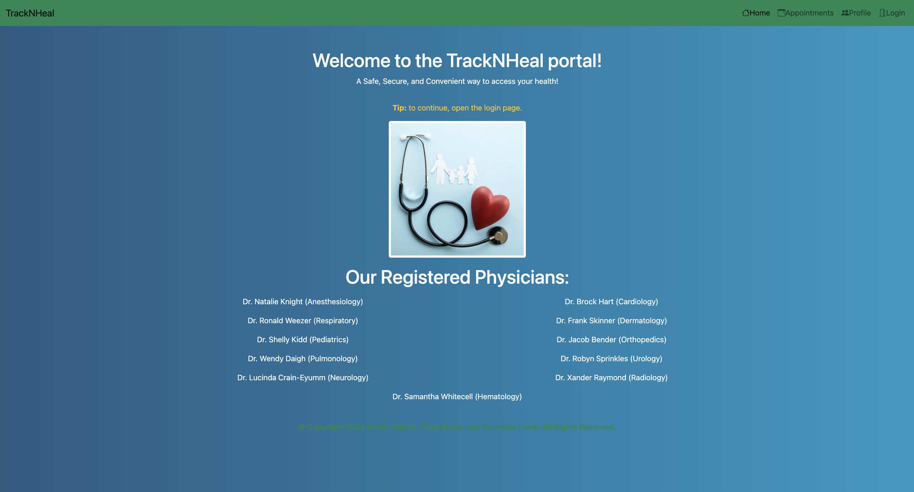

# TrackNHeal-Project

## Table of Contents:
- [Overview](#Overview)
- [The Challenge](#The-Challenge)
- [Usage Information](#Usage-Information)
- [Application Info](#Application-Info)
- [Installation Instructions](#Installation-Instructions)
- [Test Instructions](#Test-Instructions)
- [Built With](#Built-With)
- [What We Learned](#What-We-Learned)
- [License](#License)
- [Authors](#Authors)

# Overview

## The Challenge:
You and your group will create a real-world front-end application that solves a real-world problem.

## User Story

```md
As a REGISTERED DOCTOR or NEW DOCTOR ,

	I want to set-up  and/or view my online-client management process,
	I want to manage  my patient’s  medical information,
	I want to add, update and delete patients,
	I want to add notes to my patients,
	I  want to view my daily  schedule and appointments,
	I want to add, update and delete appointments,

	So I can feel more in control and improve the medical care professional to patient communication for a better overall experience and health.
```

## Acceptance Criteria

```md
* Use Node.js and Express.js to create a RESTful API.

* Use Handlebars.js as the template engine.

* Use MySQL and the Sequelize ORM for the database.

* Have both GET and POST routes for retrieving and adding new data.

* Use at least one new library, package, or technology that we haven’t discussed.

* Have a folder structure that meets the MVC paradigm.

* Include authentication (express-session and cookies).

* Protect API keys and sensitive information with environment variables.

* Be deployed using Heroku (with data).

* Have a polished UI.

* Be responsive.

* Be interactive (i.e., accept and respond to user input).

* Have a clean repository that meets quality coding standards (file structure, naming conventions, follows best practices for class/id naming conventions, indentation, quality comments, etc.).

* Have a quality README (with unique name, description, technologies used, screenshot, and link to deployed application).
```

## Application Info:
```md
With illnesses on the rise and the recent COVID-19 crisis,  website driven  healthcare systems have made it easier for patients and medical care professionals  to communicate better through the web.
Therefore, we’ve created a patient portal application!

Our (Patient-Portal)  application allows medical care professionals to manage patient health  by tracking  and viewing  their patients logs. As well as the ability to schedule an create appointments via npm calendar package.  And lastly the  user can also add new patients and add personalized notes.

```

## Installation Instructions:
Step 1: Clone repository.
<br>
Step 2: Install Nodejs.
<br>
Step 3: Install a source-code editor like VsCode.
<br>
Step 4: Nodemon is recommended in order to refresh and see updated notes data.

## Usage Instructions
Step 1: In order to run the application locally, MySQL must be installed.
<br>
Step 2: Open VsCode(preferred) or another source-code editor if not already running.
<br>
Step 3: Open integrated terminal once in the main folder.
<br>
Step 4: "run npm i" / "sudo npm i" in the terminal to install the required dependencies.
<br>
Step 5: Source the Schema and Seeds files for the database by running "npm run seeds".
<br>
Step 6: Now to run the application, Enter "nodemon index.js" or "npm start" and "node server.js" if you don't have npm nodemon.
<br>
Step 7: After the "Patient Portal Listening on port..." appears in the console, open the local host URL that's displayed in the console.


## Test Instructions:
For testing and debugging, the application logs requests and errors in the console. DBeaver, a client software application and a database administration tool, is also recommended to view the database and see it "visually."


## Solution URL:
[Solution URL Link to Live Application:]()

## Screenshots:

<br>


## Built With
- Dynamic JavaScript
- MVC (Model View Controller)
- Bootstrap & Icons
- Handlebars
- fullCalendar.js
- Day.js
- Express & express-session
- Sequelize & mysql2
- bcrypt
- License Badge: [Shields.io](https://shields.io/)
- Visual Studio Code: [Website](https://code.visualstudio.com/)

## What We Learned
1. How to build a web application that accesses the MySQL database and allows the user to view and manipulate data all while following the MVC guidelines.
2. How to structure files and create the proper routes in connection with data, displaying via Handlebars, and user inputs.
3. Team communication skills:  -Being clear about the tasks so our team knows what to do.
                                -Having a clear messaging culture to build team communication habtis and to inprove production.

## License

Licensed under the The MIT License license.

[](https://opensource.org/licenses/MIT)  (https://opensource.org/licenses/MIT)


## Authors

Aiden Wahed : [GitHub](https://github.com/prismhead26)
<br>

Elijah Matar : [GitHub](https://github.com/emmatar)
<br>

Courtney Hook : [GitHub](https://github.com/courtneyhook)


© 2024 Aiden Wahed, Elijah Matar, Courtney Hook . All Rights Reserved.